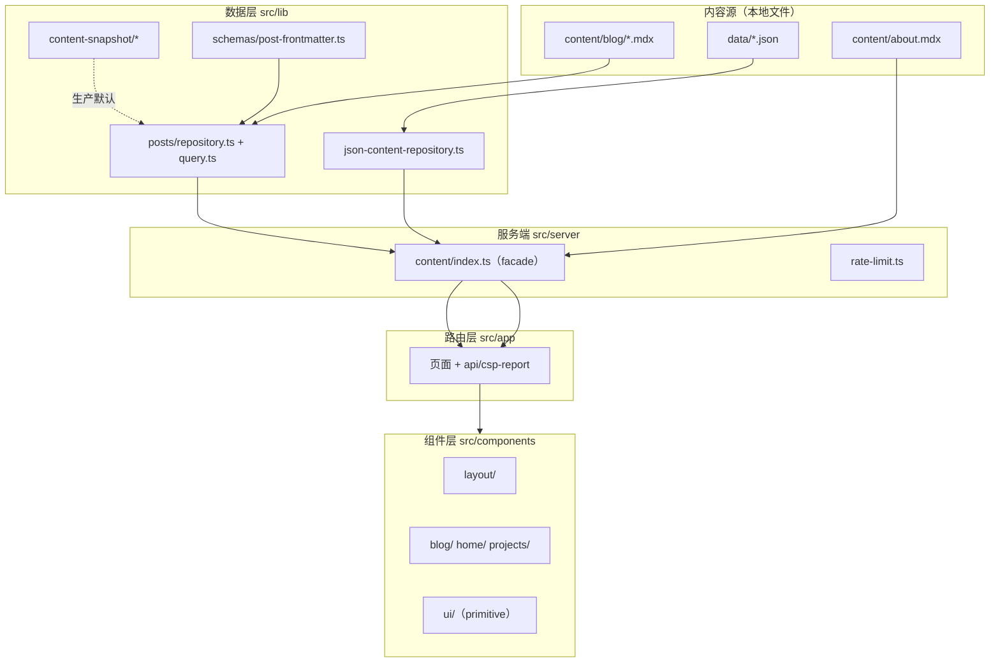

# 05 · 技术架构

> 状态：Draft（Iteration 00）
> 日期：2026-10-06
> 依据：`docs/01-project-audit.md` · `docs/ARCHITECTURE.md`（既有运行时边界）
> 约束：**不换栈**（Next 16 + React 19 + Tailwind v4），仅在既有栈内重组。

---

## 1. 总体架构



依赖方向：`components/hooks → lib（共享契约）+ HTTP`；`app → server + lib`；`server → lib`。
**硬边界**：`components` / `lib` 禁止反向 import `@/server`（`src/lib/module-boundaries.test.ts` 守门）。

---

## 2. 目录设计（目标）

```
src/
├── app/            路由页面 + api（保持不变，渐进改）
├── components/
│   ├── layout/     应用外壳：TopBar / Sidebar / MainPanel / MobileNav / Footer
│   ├── home/       首页工作台区块
│   ├── blog/       文章领域组件（列表/详情/代码/TOC…）
│   ├── search/     搜索（新增，迭代 03）
│   ├── navigation/ 面包屑 / 归档卡片
│   └── ui/         纯 primitive（button/badge/card/sheet/…）
├── lib/            数据层 + 站点配置 + 工具
├── server/         content facade + rate-limit
├── hooks/          客户端 hooks
├── config/         拟新增：siteConfig / navigationConfig（合并现有散点）
└── types/          领域类型
```

> **渐进原则**：本轮（01）**不搬迁目录**，只新增 Token 与 primitive；目录重组在迭代 02 随 App Shell 进行。

---

## 3. 分层职责

| 层         | 目录                                        | 职责                  | 约束                             |
| ---------- | ------------------------------------------- | --------------------- | -------------------------------- |
| 页面层     | `app/`                                      | 路由、metadata、组合  | 不直接读 fs / 不解析 frontmatter |
| 布局层     | `components/layout/`                        | 全站外壳              | —                                |
| 领域组件层 | `components/blog                            | home                  | projects/`                       | 业务 UI | 不 import `@/server` |
| 基础 UI 层 | `components/ui/`                            | 无业务 primitive      | 无数据依赖                       |
| 数据访问层 | `lib/*`                                     | 读取 + 校验 + 缓存    | —                                |
| 内容解析层 | `lib/parse-frontmatter.ts` · `lib/schemas/` | frontmatter → 类型    | —                                |
| 服务端层   | `server/content/`                           | facade（供 app 调用） | 仅 app/route 可用                |

---

## 4. 状态管理边界

无全局状态库。服务端组件直接取数；客户端仅局部 `useState` + 自定义 hooks（`hooks/`）。搜索状态走 URL 参数（可分享）。

## 5. 客户端/服务端组件边界

默认 RSC。`'use client'` 仅用于：交互（TOC/搜索/主题切换/Sheet/图片放大/阅读进度）。**不无意义地全标 client**。

## 6. 缓存策略

- 数据读取：`lib/cache.ts` 的 `createCache<T>`（进程内，按 mtime 失效）。
- 生产内容：`CONTENT_BACKEND=snapshot` 读 `generated/content-snapshot/`。
- 静态资产：`/_next/static` 边缘缓存；HTML 动态（CSP nonce，ADR-0003）。

## 7. 搜索架构（规划）

- **规模**：20 篇 → **客户端轻量搜索**（构建时生成索引或运行时读 `posts-meta`）。
- **实现**：复用 `fuse.js`（已在依赖）或纯字符串匹配；索引 DTO 仅含 `slug/title/description/tags/category`。
- **升级路径**：内容 >200 篇时评估服务端搜索（ADR-0006 既有结论）。
- **不做**：`/api/search` 服务端引擎（上一轮已删，规模不匹配）。

## 8. 错误处理

- 内容 fail-fast：生产缺文件/坏 JSON 抛错；开发/测试 lenient 回落。
- 页面级：`app/error.tsx` + `app/not-found.tsx`（**当前链到已删 `/links`，待修**）。
- API：`/api/csp-report` collect-only，吞解析错误返 204。

## 9. 日志策略

`lib/observability.ts` 控制 Vercel Analytics/SpeedInsights 渲染；CSP 违规经 `console.warn` 落平台日志。

## 10. 测试边界

| 层   | 工具            | 覆盖                            |
| ---- | --------------- | ------------------------------- |
| 单元 | Vitest          | `lib/*`、hooks、纯函数          |
| 组件 | Testing Library | `components/*`                  |
| E2E  | Playwright      | 导航、搜索、文章、移动端        |
| 门禁 | scripts         | SEO / snapshot / SRI / 文档死链 |

## 11. 扩展方向

- 内容 >200 篇 → 服务端搜索。
- 多作者 → `authors` 字段（当前无）。
- 收藏/最近阅读 → localStorage（迭代 05）。

## 12. 架构约束（不可破）

1. 页面不直接解析 MD / frontmatter。
2. 页面不直接访问 fs。
3. 内容读取集中 `lib/` + `server/content`。
4. Design Token 集中 `tokens.css`。
5. 领域组件与纯 UI 分离。
6. 不建超大万能组件 / 过度抽象工厂。
7. 导航配置单一来源（`lib/navigation.ts`）。
8. 不重复 Metadata 逻辑（用 `lib/metadata.ts`）。
9. 客户端组件范围尽量小。
10. 新增依赖须记决策日志。
